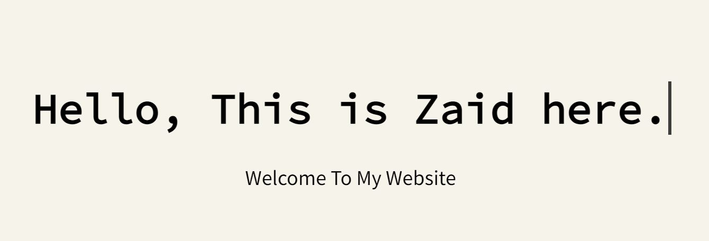

# Typing-Animation

This is a Typing Animation just using CSS.

## Table of contents

- [Overview](#overview)
  - [The challenge](#the-challenge)
  - [Screenshot](#screenshot)
  - [Links](#links)
- [My process](#my-process)
  - [Built with](#built-with)
  - [What I learned](#what-i-learned)
- [Author](#author)

## Overview

### The challenge

Users should be able to:

- View the optimal Typing animation on the screen.

### Screenshot



### Links

- Solution URL: [Github](https://github.com/zaidansari42/Typing-Animation/)
- Live Site URL: [Live Website](https://zaidansari42.github.io/Typing-Animation/)

## My process

### Built with

- Semantic HTML5 markup
- CSS custom properties
- Flexbox

### What I learned

I learned how to create a Grid Layout with only HTML & CSS.

```html
<div>
  <h1>Hello, This is Zaid here.</h1>
</div>
```

```css
h1::before {
  content: "";
  background-color: var(--bg-color);
  position: absolute;
  top: 0;
  left: 0;
  right: 0;
  height: 100%;
  animation: slide var(--typewriterspeed) steps(25) 2s forwards;
}
```

## Author

- Website - [Zaid Ansari](https://github.com/zaidansari42/)
- Twitter - [@zaidnasari42](https://www.twitter.com/zaidnasari42)
